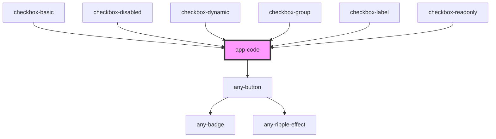

# app-code

<!-- Auto Generated Below -->

## Properties

| Property                | Attribute           | Description | Type      | Default     |
| ----------------------- | ------------------- | ----------- | --------- | ----------- |
| `code` _(required)_     | `code`              |             | `any`     | `undefined` |
| `extFiles`              | --                  |             | `any[]`   | `[]`        |
| `hideCodeSandbox`       | `hide-code-sandbox` |             | `boolean` | `false`     |
| `hideStackBlitz`        | `hide-stack-blitz`  |             | `boolean` | `false`     |
| `hideToggleCode`        | `hide-toggle-code`  |             | `boolean` | `false`     |
| `routeFiles`            | --                  |             | `any[]`   | `[]`        |
| `selector` _(required)_ | `selector`          |             | `string`  | `undefined` |
| `service`               | `service`           |             | `any`     | `undefined` |

## Dependencies

### Used by

 - [checkbox-basic](../../pages/checkbox/checkbox-basic)
 - [checkbox-disabled](../../pages/checkbox/checkbox-disabled)
 - [checkbox-dynamic](../../pages/checkbox/checkbox-dynamic)
 - [checkbox-group](../../pages/checkbox/checkbox-group)
 - [checkbox-label](../../pages/checkbox/checkbox-label)
 - [checkbox-readonly](../../pages/checkbox/checkbox-readonly)

### Depends on

- [any-button](../../../button)

### Graph

----------------------------------------------

*Built with love by **AdaleksTech!***
