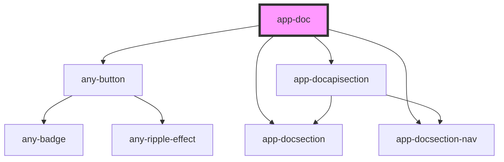

# app-doc

<!-- Auto Generated Below -->

## Properties

| Property                   | Attribute     | Description | Type       | Default     |
| -------------------------- | ------------- | ----------- | ---------- | ----------- |
| `apiDocs` _(required)_     | --            |             | `string[]` | `undefined` |
| `description` _(required)_ | `description` |             | `string`   | `undefined` |
| `docTitle`                 | `doc-title`   |             | `string`   | `undefined` |
| `docs` _(required)_        | --            |             | `any[]`    | `undefined` |
| `githubPage` _(required)_  | `github-page` |             | `string`   | `undefined` |
| `header` _(required)_      | `header`      |             | `string`   | `undefined` |

## Dependencies

### Depends on

- [any-button](../../../button)
- [app-docsection](../app-docsection)
- [app-docsection-nav](../app-docsection-nav)
- [app-docapisection](../app-docapisection)

### Graph

----------------------------------------------

*Built with love by **AdaleksTech!***
