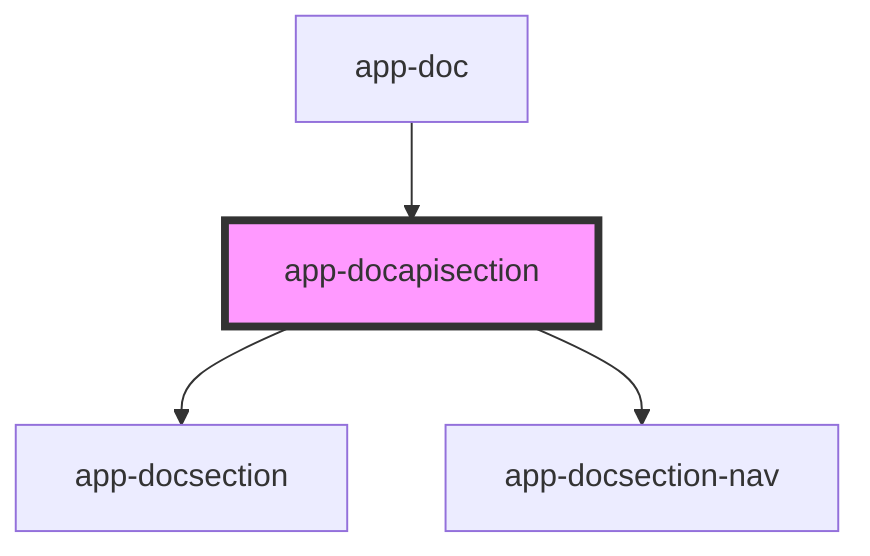

# app-docapisection

<!-- Auto Generated Below -->

## Properties

| Property | Attribute | Description | Type     | Default     |
| -------- | --------- | ----------- | -------- | ----------- |
| `docs`   | `docs`    |             | `any`    | `undefined` |
| `header` | `header`  |             | `string` | `undefined` |

## Dependencies

### Used by

 - [app-doc](../app-doc)

### Depends on

- [app-docsection](../app-docsection)
- [app-docsection-nav](../app-docsection-nav)

### Graph

----------------------------------------------

*Built with love by **AdaleksTech!***
