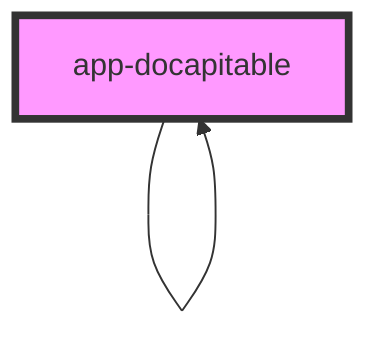

# app-docapitable

<!-- Auto Generated Below -->

## Properties

| Property            | Attribute            | Description | Type      | Default     |
| ------------------- | -------------------- | ----------- | --------- | ----------- |
| `anyId`             | `any-id`             |             | `string`  | `undefined` |
| `data`              | --                   |             | `any[]`   | `undefined` |
| `description`       | `description`        |             | `string`  | `undefined` |
| `isInterface`       | `is-interface`       |             | `boolean` | `false`     |
| `label`             | `label`              |             | `string`  | `undefined` |
| `level`             | `level`              |             | `number`  | `undefined` |
| `parentDescription` | `parent-description` |             | `string`  | `undefined` |
| `parentId`          | `parent-id`          |             | `string`  | `undefined` |
| `parentTitle`       | `parent-title`       |             | `string`  | `undefined` |
| `relatedProp`       | `related-prop`       |             | `string`  | `undefined` |

## Dependencies

### Used by

 - [app-docapitable](.)

### Depends on

- [app-docsectiontext](../app-docsectiontext)
- [app-docapitable](.)

### Graph

----------------------------------------------

*Built with love by **AdaleksTech!***
