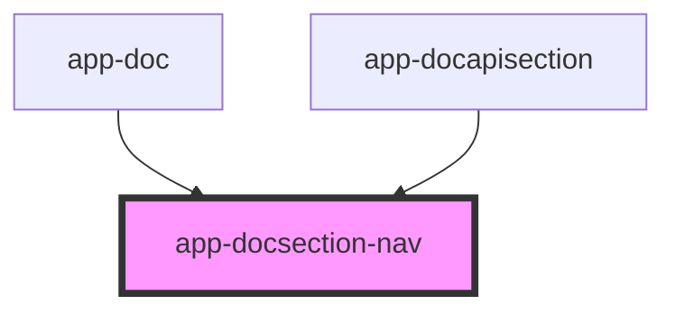

# app-docsection-nav

<!-- Auto Generated Below -->

## Properties

| Property            | Attribute | Description | Type    | Default     |
| ------------------- | --------- | ----------- | ------- | ----------- |
| `docs` _(required)_ | --        |             | `any[]` | `undefined` |

## Dependencies

### Used by

 - [app-doc](../app-doc)
 - [app-docapisection](../app-docapisection)

### Graph

----------------------------------------------

*Built with love by **AdaleksTech!***
