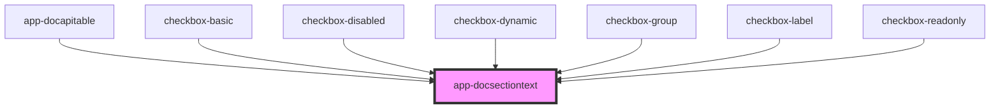

# app-docsectiontext

<!-- Auto Generated Below -->

## Properties

| Property            | Attribute            | Description | Type     | Default     |
| ------------------- | -------------------- | ----------- | -------- | ----------- |
| `label`             | `label`              |             | `string` | `undefined` |
| `level`             | `level`              |             | `number` | `2`         |
| `parentDescription` | `parent-description` |             | `string` | `undefined` |
| `parentId`          | `parent-id`          |             | `string` | `undefined` |
| `parentTitle`       | `parent-title`       |             | `string` | `undefined` |
| `textId`            | `text-id`            |             | `string` | `undefined` |
| `textTitle`         | `text-title`         |             | `string` | `undefined` |

## Dependencies

### Used by

 - [app-docapitable](../app-docapitable)
 - [checkbox-basic](../../pages/checkbox/checkbox-basic)
 - [checkbox-disabled](../../pages/checkbox/checkbox-disabled)
 - [checkbox-dynamic](../../pages/checkbox/checkbox-dynamic)
 - [checkbox-group](../../pages/checkbox/checkbox-group)
 - [checkbox-label](../../pages/checkbox/checkbox-label)
 - [checkbox-readonly](../../pages/checkbox/checkbox-readonly)

### Graph

----------------------------------------------

*Built with love by **AdaleksTech!***
