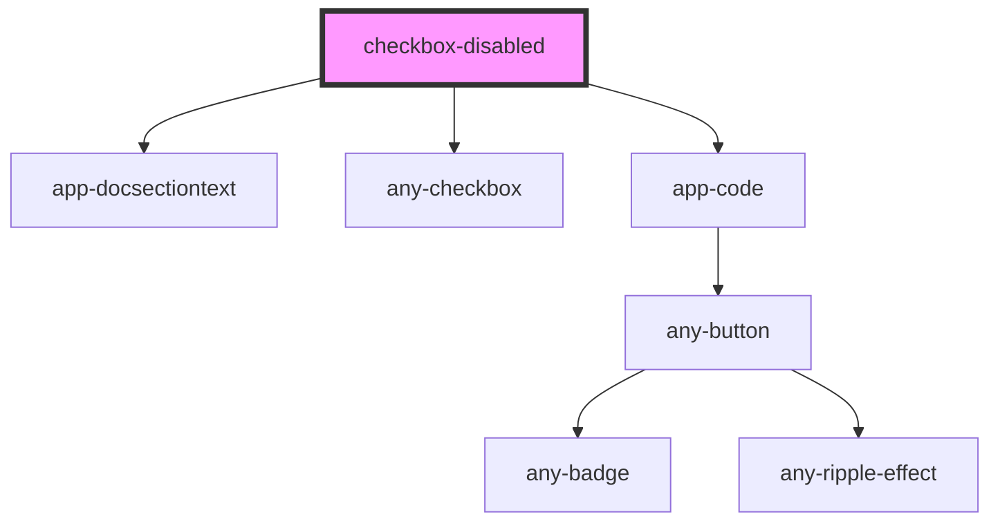

# checkbox-disabled

<!-- Auto Generated Below -->

## Properties

| Property    | Attribute    | Description | Type     | Default     |
| ----------- | ------------ | ----------- | -------- | ----------- |
| `textId`    | `text-id`    |             | `string` | `undefined` |
| `textTitle` | `text-title` |             | `string` | `undefined` |

## Events

| Event         | Description | Type                   |
| ------------- | ----------- | ---------------------- |
| `valueChange` |             | `CustomEvent<boolean>` |

## Dependencies

### Depends on

- [app-docsectiontext](../../../doc/app-docsectiontext)
- [any-checkbox](../../../../checkbox)
- [app-code](../../../doc/app-code)

### Graph

----------------------------------------------

*Built with love by **AdaleksTech!***
