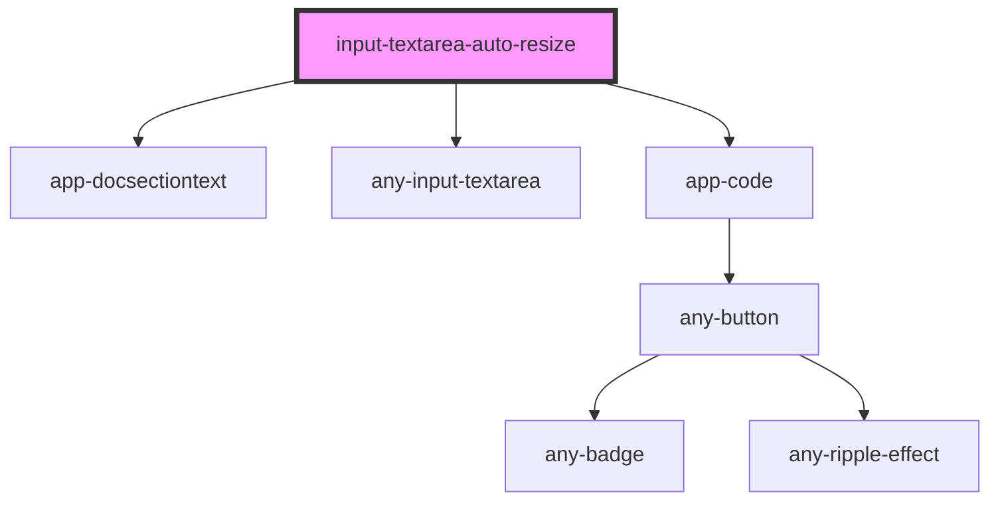

# input-textarea-auto-resize

<!-- Auto Generated Below -->

## Properties

| Property    | Attribute    | Description | Type     | Default     |
| ----------- | ------------ | ----------- | -------- | ----------- |
| `textId`    | `text-id`    |             | `string` | `undefined` |
| `textTitle` | `text-title` |             | `string` | `undefined` |

## Dependencies

### Depends on

- [app-docsectiontext](../../../doc/app-docsectiontext)
- [any-input-textarea](../../../../input-textarea)
- [app-code](../../../doc/app-code)

### Graph

----------------------------------------------

*Built with love by **AdaleksTech!***
