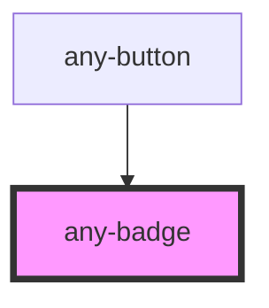

# any-badge-overlay

<!-- Auto Generated Below -->

## Properties

| Property     | Attribute     | Description                                                | Type     | Default |
| ------------ | ------------- | ---------------------------------------------------------- | -------- | ------- |
| `anyStyle`   | `any-style`   | Inline style of the component.                             | `any`    | `null`  |
| `severity`   | `severity`    | Severity type of the badge.                                | `string` | `null`  |
| `size`       | `size`        | Size of the badge, valid options are "large" and "xlarge". | `string` | `null`  |
| `styleClass` | `style-class` | Style class of the component.                              | `string` | `null`  |
| `value`      | `value`       | Value to display inside the badge.                         | `string` | `null`  |

## Shadow Parts

| Part          | Description |
| ------------- | ----------- |
| `"any-badge"` |             |

## Dependencies

### Used by

 - [any-button](../button)

### Graph

----------------------------------------------

*Built with love by **AdaleksTech!***
