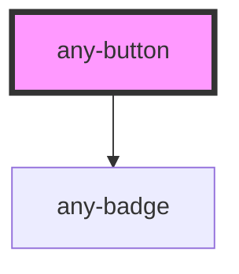

# any-button

<!-- Auto Generated Below -->

## Properties

| Property                | Attribute                  | Description                                                       | Type                                     | Default              |
| ----------------------- | -------------------------- | ----------------------------------------------------------------- | ---------------------------------------- | -------------------- |
| `anyStyle`              | `any-style`                | Inline style of the element.                                      | `any`                                    | `null`               |
| `badge`                 | `badge`                    | Value of the badge.                                               | `string`                                 | `null`               |
| `badgeClass`            | `badge-class`              | Style class of the badge.                                         | `string`                                 | `null`               |
| `disabled`              | `disabled`                 | When present, it specifies that the component should be disabled. | `boolean`                                | `false`              |
| `icon`                  | `icon`                     | Name of the icon.                                                 | `string`                                 | `null`               |
| `iconHeight`            | `icon-height`              | Height of the icon                                                | `number`                                 | `null`               |
| `iconPos`               | `icon-pos`                 | Position of the icon, valid values are "left" and "right".        | `"bottom" \| "left" \| "right" \| "top"` | `"left"`             |
| `iconWidth`             | `icon-width`               | Width of the icon                                                 | `number`                                 | `null`               |
| `label`                 | `label`                    | Text of the button.                                               | `string`                                 | `null`               |
| `loading`               | `loading`                  | Whether the button is in loading state.                           | `boolean`                                | `false`              |
| `loadingIcon`           | `loading-icon`             | Icon to display in loading state.                                 | `string`                                 | `"fa-solid:spinner"` |
| `loadingIconStyleClass` | `loading-icon-style-class` | Style class of the icon element                                   | `string`                                 | `"any-spin"`         |
| `styleClass`            | `style-class`              | Style class of the element.                                       | `string`                                 | `null`               |
| `type`                  | `type`                     | Type of the button.                                               | `"button" \| "reset" \| "submit"`        | `"button"`           |

## Events

| Event      | Description                                  | Type               |
| ---------- | -------------------------------------------- | ------------------ |
| `aOnBlur`  | Callback to execute when button loses focus. | `CustomEvent<any>` |
| `aOnClick` | Callback to execute when button is clicked.  | `CustomEvent<any>` |
| `aOnFocus` | Callback to execute when button is focused.  | `CustomEvent<any>` |

## Shadow Parts

| Part           | Description |
| -------------- | ----------- |
| `"any-button"` |             |

## Dependencies

### Depends on

- [any-badge](../badge)

### Graph

----------------------------------------------

*Built with love by **AdaleksTech!***
