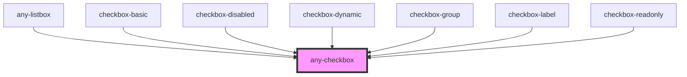

# any-checkbox

<!-- Auto Generated Below -->

## Overview

Checkbox is an extension to the standard checkbox element with theming.

## Properties

| Property          | Attribute           | Description                                                                                                                                                                                                                                                  | Type      | Default                     |
| ----------------- | ------------------- | ------------------------------------------------------------------------------------------------------------------------------------------------------------------------------------------------------------------------------------------------------------ | --------- | --------------------------- |
| `anyStyle`        | `any-style`         | Inline style of the component.                                                                                                                                                                                                                               | `any`     | `null`                      |
| `anyTabIndex`     | `any-tab-index`     | Index of the element in tabbing order                                                                                                                                                                                                                        | `number`  | `0`                         |
| `binary`          | `binary`            | Allows to select a boolean value instead of multiple values.                                                                                                                                                                                                 | `boolean` | `false`                     |
| `checkboxIcon`    | `checkbox-icon`     | Icon class of the checkbox icon.                                                                                                                                                                                                                             | `string`  | `"fa-solid:check"`          |
| `checked`         | `checked`           | If `true`, the checkbox is selected.                                                                                                                                                                                                                         | `boolean` | `false`                     |
| `disabled`        | `disabled`          | When present, it specifies that the element should be disabled.                                                                                                                                                                                              | `boolean` | `false`                     |
| `inputId`         | `input-id`          | Identifier of the focus input to match a label defined for the component.                                                                                                                                                                                    | `string`  | ``any-cb-${checkboxIds++}`` |
| `label`           | `label`             | Label of the checkbox.                                                                                                                                                                                                                                       | `string`  | `null`                      |
| `labelStyleClass` | `label-style-class` | Style class of the label.                                                                                                                                                                                                                                    | `string`  | `null`                      |
| `name`            | `name`              | Name of the checkbox group.                                                                                                                                                                                                                                  | `string`  | `this.inputId`              |
| `readonly`        | `readonly`          | When present, it specifies that the component cannot be edited.                                                                                                                                                                                              | `boolean` | `false`                     |
| `styleClass`      | `style-class`       | Style class of the component.                                                                                                                                                                                                                                | `any`     | `null`                      |
| `value`           | `value`             | The value of the checkbox does not mean if it's checked or not, use the `checked` property for that.  The value of a checkbox is analogous to the value of an `<input type="checkbox">`, it's only used when the checkbox participates in a native `<form>`. | `any`     | `"on"`                      |

## Events

| Event         | Description                                        | Type               |
| ------------- | -------------------------------------------------- | ------------------ |
| `aOnBlur`     | Emitted when the toggle loses focus.               | `CustomEvent<any>` |
| `aOnFocus`    | Emitted when the toggle has focus.                 | `CustomEvent<any>` |
| `valueChange` | Callback to invoke when value of dropdown changes. | `CustomEvent<any>` |

## Methods

### `inputFocus() => Promise<void>`

Focuses on the checkbox element.

#### Returns

Type: `Promise<void>`

## Slots

| Slot      | Description                                                                                                                                                  |
| --------- | ------------------------------------------------------------------------------------------------------------------------------------------------------------ |
| `"label"` | Represents the label or content associated with the checkbox. Use this slot to provide descriptive text or additional content that accompanies the checkbox. |

## Shadow Parts

| Part                           | Description                                                                                                    |
| ------------------------------ | -------------------------------------------------------------------------------------------------------------- |
| `"any-checkbox-box"`           | This refers to the actual checkmark symbol within the checkbox, indicating the checked state of the component. |
| `"any-checkbox-box-highlight"` | This represents the container that encapsulates the checkbox mark and its associated visual elements.          |

## CSS Custom Properties

| Name                               | Description                                                   |
| ---------------------------------- | ------------------------------------------------------------- |
| `--checkboxActiveBg`               | The background color of the checkbox when active.             |
| `--checkboxActiveBorderColor`      | The border color of the checkbox when active.                 |
| `--checkboxActiveHoverBg`          | The background color of the checkbox when active and hovered. |
| `--checkboxActiveHoverBorderColor` | The border color of the checkbox when active and hovered.     |
| `--checkboxBorder`                 | The border of the checkbox.                                   |
| `--checkboxHeight`                 | The height of the checkbox.                                   |
| `--checkboxIconActiveColor`        | The color of the checkbox icon when active.                   |
| `--checkboxIconActiveHoverColor`   | The color of the checkbox icon when active and hovered.       |
| `--checkboxIconFontSize`           | The font size of the checkbox icon.                           |
| `--checkboxWidth`                  | The width of the checkbox.                                    |

## Dependencies

### Used by

 - [any-listbox](../listbox)
 - [checkbox-basic](../app-showcase/pages/checkbox/checkbox-basic)
 - [checkbox-disabled](../app-showcase/pages/checkbox/checkbox-disabled)
 - [checkbox-dynamic](../app-showcase/pages/checkbox/checkbox-dynamic)
 - [checkbox-group](../app-showcase/pages/checkbox/checkbox-group)
 - [checkbox-label](../app-showcase/pages/checkbox/checkbox-label)
 - [checkbox-readonly](../app-showcase/pages/checkbox/checkbox-readonly)

### Graph

----------------------------------------------

*Built with love by **AdaleksTech!***
