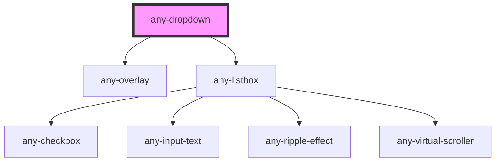

# AnyDropdown

<!-- Auto Generated Below -->

## Properties

| Property            | Attribute             | Description                                                                                   | Type      | Default                     |
| ------------------- | --------------------- | --------------------------------------------------------------------------------------------- | --------- | --------------------------- |
| `anyStyle`          | `any-style`           | Inline style of the element                                                                   | `any`     | `null`                      |
| `anyTabIndex`       | `any-tab-index`       | Index of the element in tabbing order                                                         | `number`  | `0`                         |
| `autoZIndex`        | `auto-z-index`        | Whether to automatically manage layering                                                      | `boolean` | `true`                      |
| `baseZIndex`        | `base-z-index`        | Base zIndex value to use in layering                                                          | `string`  | `"0"`                       |
| `clearIcon`         | `clear-icon`          | Icon class of the dropdown clear icon                                                         | `string`  | `"fa-solid:times"`          |
| `disabled`          | `disabled`            | When present, it specifies that the element should be disabled                                | `boolean` | `false`                     |
| `dropdownIcon`      | `dropdown-icon`       | Icon class of the dropdown icon                                                               | `string`  | `"fa-solid:chevron-down"`   |
| `filter`            | `filter`              | When specified, displays a filter input at header                                             | `boolean` | `false`                     |
| `hideAnimation`     | `hide-animation`      | Transition options of the hide animation                                                      | `string`  | `"growUp"`                  |
| `inputId`           | `input-id`            | Identifier of the focus input to match a label defined for the component.                     | `string`  | ``any-dd-${dropdownIds++}`` |
| `name`              | `name`                | Name of the dropdown input.                                                                   | `string`  | `this.inputId`              |
| `optionLabel`       | `option-label`        | Name of the label field of an option                                                          | `string`  | `"label"`                   |
| `optionValue`       | `option-value`        | Name of the value field of an option                                                          | `string`  | `"value"`                   |
| `options`           | --                    | An array of objects to display as the available options.                                      | `any[]`   | `null`                      |
| `panelScrollHeight` | `panel-scroll-height` | Height of the viewport in pixels, a scrollbar is defined if height of list exceeds this value | `string`  | `"200px"`                   |
| `placeholder`       | `placeholder`         | Default text to display when no option is selected                                            | `string`  | `null`                      |
| `readonly`          | `readonly`            | When present, it specifies that the element value cannot be changed                           | `boolean` | `false`                     |
| `showAnimation`     | `show-animation`      | Keyframe name the show animation                                                              | `string`  | `"growDown"`                |
| `showClear`         | `show-clear`          | When enabled, a clear icon is displayed to clear the value                                    | `boolean` | `false`                     |
| `value`             | `value`               | Value of the dropdown list                                                                    | `any`     | `null`                      |
| `virtualScroll`     | `virtual-scroll`      | When present, list virtual scroller is enabled                                                | `boolean` | `false`                     |

## Events

| Event               | Description                                                  | Type               |
| ------------------- | ------------------------------------------------------------ | ------------------ |
| `aOnBlur`           | Callback to invoke when dropdown loses focus                 | `CustomEvent<any>` |
| `aOnClick`          | Callback to invoke when component is clicked                 | `CustomEvent<any>` |
| `aOnFocus`          | Callback to invoke when dropdown gets focus                  | `CustomEvent<any>` |
| `aOnPanelHide`      | Callback to invoke when dropdown overlay gets hidden         | `CustomEvent<any>` |
| `aOnPanelHideStart` | Callback to invoke when dropdown overlay before gets hidden  | `CustomEvent<any>` |
| `aOnPanelShow`      | Callback to invoke when dropdown overlay gets visible        | `CustomEvent<any>` |
| `aOnPanelShowStart` | Callback to invoke when dropdown overlay before gets visible | `CustomEvent<any>` |
| `valueChange`       | Callback to invoke when value of dropdown changes            | `CustomEvent<any>` |

## Shadow Parts

| Part             | Description |
| ---------------- | ----------- |
| `"any-dropdown"` |             |

## Dependencies

### Depends on

- [any-overlay](../overlay)
- [any-listbox](../listbox)

### Graph

----------------------------------------------

*Built with love by **AdaleksTech!***
