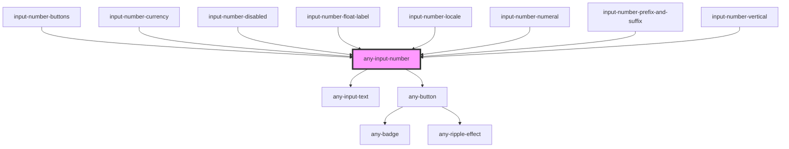

# any-input-number

<!-- Auto Generated Below -->

## Overview

InputNumber is a component for numeric input, allowing users to input numeric values.

## Properties

| Property               | Attribute                | Description                                                                                                                                                                                                                                                                                                                                                                                                                                    | Type      | Default                            |
| ---------------------- | ------------------------ | ---------------------------------------------------------------------------------------------------------------------------------------------------------------------------------------------------------------------------------------------------------------------------------------------------------------------------------------------------------------------------------------------------------------------------------------------- | --------- | ---------------------------------- |
| `aPrefix`              | `a-prefix`               | Text to display before the value.                                                                                                                                                                                                                                                                                                                                                                                                              | `string`  | `undefined`                        |
| `aSuffix`              | `a-suffix`               | Text to display after the value.                                                                                                                                                                                                                                                                                                                                                                                                               | `string`  | `undefined`                        |
| `aTitle`               | `a-title`                | Title text of the input text.                                                                                                                                                                                                                                                                                                                                                                                                                  | `string`  | `undefined`                        |
| `allowEmpty`           | `allow-empty`            | Determines whether the input field is empty.                                                                                                                                                                                                                                                                                                                                                                                                   | `boolean` | `true`                             |
| `anyAriaRequired`      | `any-aria-required`      | Used to indicate that user input is required on an element before a form can be submitted.                                                                                                                                                                                                                                                                                                                                                     | `boolean` | `undefined`                        |
| `anyStyle`             | `any-style`              | Inline style of the component.                                                                                                                                                                                                                                                                                                                                                                                                                 | `any`     | `undefined`                        |
| `anyTabIndex`          | `any-tab-index`          | Specifies tab order of the element.                                                                                                                                                                                                                                                                                                                                                                                                            | `string`  | `undefined`                        |
| `autocomplete`         | `autocomplete`           | Used to define a string that autocomplete attribute the current element.                                                                                                                                                                                                                                                                                                                                                                       | `string`  | `undefined`                        |
| `buttonLayout`         | `button-layout`          | Layout of the buttons, valid values are "stacked" (default), "horizontal" and "vertical".                                                                                                                                                                                                                                                                                                                                                      | `string`  | `"stacked"`                        |
| `currency`             | `currency`               | The currency to use in currency formatting. Possible values are the ISO 4217 currency codes(https://www.currency-iso.org/en/home/tables/table-a1.html), such as "USD" for the US dollar, "EUR" for the euro, or "CNY" for the Chinese RMB. There is no default value; if the style is "currency", the currency property must be provided.                                                                                                      | `string`  | `undefined`                        |
| `currencyDisplay`      | `currency-display`       | How to display the currency in currency formatting. Possible values are "symbol" to use a localized currency symbol such as €, ü"code" to use the ISO currency code, "name" to use a localized currency name such as "dollar"; the default is "symbol".                                                                                                                                                                                        | `string`  | `undefined`                        |
| `decrementButtonClass` | `decrement-button-class` | Style class of the decrement button.                                                                                                                                                                                                                                                                                                                                                                                                           | `string`  | `undefined`                        |
| `decrementButtonIcon`  | `decrement-button-icon`  | Style class of the decrement button.                                                                                                                                                                                                                                                                                                                                                                                                           | `string`  | `"fa-solid:angle-down"`            |
| `disabled`             | `disabled`               | When present, it specifies that the element should be disabled.                                                                                                                                                                                                                                                                                                                                                                                | `boolean` | `false`                            |
| `floatLabel`           | `float-label`            | When enabled, the label will have floating effect on input text focus                                                                                                                                                                                                                                                                                                                                                                          | `boolean` | `false`                            |
| `format`               | `format`                 | Whether to format the value.                                                                                                                                                                                                                                                                                                                                                                                                                   | `boolean` | `true`                             |
| `incrementButtonClass` | `increment-button-class` | Style class of the increment button.                                                                                                                                                                                                                                                                                                                                                                                                           | `string`  | `undefined`                        |
| `incrementButtonIcon`  | `increment-button-icon`  | Style class of the increment button.                                                                                                                                                                                                                                                                                                                                                                                                           | `string`  | `"fa-solid:angle-up"`              |
| `inputId`              | `input-id`               | Identifier of the focus input to match a label defined for the component.                                                                                                                                                                                                                                                                                                                                                                      | `string`  | ``any-input-number-${inputIds++}`` |
| `inputStyle`           | `input-style`            | Inline style of the input field.                                                                                                                                                                                                                                                                                                                                                                                                               | `any`     | `undefined`                        |
| `inputStyleClass`      | `input-style-class`      | Style class of the input field.                                                                                                                                                                                                                                                                                                                                                                                                                | `string`  | `undefined`                        |
| `inputWrapperClass`    | `input-wrapper-class`    | The class of input wrapper element                                                                                                                                                                                                                                                                                                                                                                                                             | `string`  | `null`                             |
| `label`                | `label`                  | Label of the component                                                                                                                                                                                                                                                                                                                                                                                                                         | `string`  | `null`                             |
| `locale`               | `locale`                 | Locale to be used in formatting.                                                                                                                                                                                                                                                                                                                                                                                                               | `string`  | `undefined`                        |
| `localeMatcher`        | `locale-matcher`         | The locale matching algorithm to use. Possible values are "lookup" and "best fit"; the default is "best fit". See https://developer.mozilla.org/en-US/docs/Web/JavaScript/Reference/Global_Objects/Intl#Locale_negotiation for details.                                                                                                                                                                                                        | `string`  | `undefined`                        |
| `max`                  | `max`                    | Maximum boundary value.                                                                                                                                                                                                                                                                                                                                                                                                                        | `number`  | `undefined`                        |
| `maxFractionDigits`    | `max-fraction-digits`    | The maximum number of fraction digits to use. Possible values are from 0 to 20; the default for plain number formatting is the larger of minimumFractionDigits and 3; the default for currency formatting is the larger of minimumFractionDigits and the number of minor unit digits provided by the ISO 4217 currency code list (https://www.currency-iso.org/en/home/tables/table-a1.html) (2 if the list doesn't provide that information). | `number`  | `undefined`                        |
| `maxlength`            | `maxlength`              | Maximum number of character allows in the input field.                                                                                                                                                                                                                                                                                                                                                                                         | `number`  | `undefined`                        |
| `min`                  | `min`                    | Mininum boundary value.                                                                                                                                                                                                                                                                                                                                                                                                                        | `number`  | `undefined`                        |
| `minFractionDigits`    | `min-fraction-digits`    | The minimum number of fraction digits to use. Possible values are from 0 to 20; the default for plain number and percent formatting is 0; the default for currency formatting is the number of minor unit digits provided by the ISO 4217 currency code list (https://www.currency-iso.org/en/home/tables/table-a1.html) (2 if the list doesn't provide that information).                                                                     | `number`  | `undefined`                        |
| `mode`                 | `mode`                   | Defines the behavior of the component, valid values are "decimal" and "currency".                                                                                                                                                                                                                                                                                                                                                              | `string`  | `"decimal"`                        |
| `name`                 | `name`                   | Name of the component                                                                                                                                                                                                                                                                                                                                                                                                                          | `string`  | `undefined`                        |
| `placeholder`          | `placeholder`            | Advisory information to display on input.                                                                                                                                                                                                                                                                                                                                                                                                      | `string`  | `undefined`                        |
| `readonly`             | `readonly`               | When present, it specifies that an input field is read-only.                                                                                                                                                                                                                                                                                                                                                                                   | `boolean` | `false`                            |
| `required`             | `required`               | When present, it specifies that an input field is required.                                                                                                                                                                                                                                                                                                                                                                                    | `boolean` | `undefined`                        |
| `showButtons`          | `show-buttons`           | Displays spinner buttons.                                                                                                                                                                                                                                                                                                                                                                                                                      | `boolean` | `false`                            |
| `size`                 | `size`                   | Size of the input field.                                                                                                                                                                                                                                                                                                                                                                                                                       | `number`  | `undefined`                        |
| `step`                 | `step`                   | Step factor to increment/decrement the value.                                                                                                                                                                                                                                                                                                                                                                                                  | `number`  | `1`                                |
| `styleClass`           | `style-class`            | Style class of the component.                                                                                                                                                                                                                                                                                                                                                                                                                  | `string`  | `undefined`                        |
| `useGrouping`          | `use-grouping`           | Whether to use grouping separators, such as thousands separators or thousand/lakh/crore separators.                                                                                                                                                                                                                                                                                                                                            | `boolean` | `true`                             |
| `value`                | `value`                  | Value of the component.                                                                                                                                                                                                                                                                                                                                                                                                                        | `number`  | `null`                             |

## Events

| Event         | Description                                       | Type               |
| ------------- | ------------------------------------------------- | ------------------ |
| `aOnBlur`     | Callback to invoke when input loses focus.        | `CustomEvent<any>` |
| `aOnFocus`    | Callback to invoke when input receives focus.     | `CustomEvent<any>` |
| `aOnInput`    | Callback to invoke when the value is entered.     | `CustomEvent<any>` |
| `aOnKeyDown`  | Callback to invoke when keyboard key is down.     | `CustomEvent<any>` |
| `valueChange` | Callback to invoke when value of componnt changes | `CustomEvent<any>` |

## Slots

| Slot      | Description                                                                                                                                      |
| --------- | ------------------------------------------------------------------------------------------------------------------------------------------------ |
| `"end"`   | Represents the content or elements to be placed after the numeric input. Use this slot to add any content or components after the input field.   |
| `"start"` | Represents the content or elements to be placed before the numeric input. Use this slot to add any content or components before the input field. |

## CSS Custom Properties

| Name                          | Description                                                                                                                |
| ----------------------------- | -------------------------------------------------------------------------------------------------------------------------- |
| `--inputBgColor`              | The background color of the input field.                                                                                   |
| `--inputBorder`               | The border of the input field.                                                                                             |
| `--inputErrorBorder`          | The border of the input field in case of an error.                                                                         |
| `--inputErrorBorderColor`     | The border color of the input field in case of an error, using the --errorColor variable.                                  |
| `--inputFilledBg`             | The background color of the input field when filled.                                                                       |
| `--inputFilledFocusBg`        | The background color of the input field when filled and focused.                                                           |
| `--inputFilledHoverBg`        | The background color of the input field when filled and hovered.                                                           |
| `--inputFocusBorderColor`     | The border color of the input field on focus, using the --primaryColor variable.                                           |
| `--inputHoverBorderColor`     | The border color of the input field on hover, using the --primaryColor variable.                                           |
| `--inputIconColor`            | The color of icons within the input field, using the --textColor variable.                                                 |
| `--inputPadding`              | The padding of the input field.                                                                                            |
| `--inputPlaceholderTextColor` | The text color of the input field placeholder.                                                                             |
| `--inputTextColor`            | The text color of the input field, using the --textColor variable.                                                         |
| `--inputTransition`           | The transition effect for the input field, involving border color and box shadow, using the --transitionDuration variable. |

## Dependencies

### Used by

 - [input-number-buttons](../app-showcase/pages/input-number/input-number-buttons)
 - [input-number-currency](../app-showcase/pages/input-number/input-number-currency)
 - [input-number-disabled](../app-showcase/pages/input-number/input-number-disabled)
 - [input-number-float-label](../app-showcase/pages/input-number/input-number-float-label)
 - [input-number-locale](../app-showcase/pages/input-number/input-number-locale)
 - [input-number-numeral](../app-showcase/pages/input-number/input-number-numeral)
 - [input-number-prefix-and-suffix](../app-showcase/pages/input-number/input-number-prefix-and-suffix)
 - [input-number-vertical](../app-showcase/pages/input-number/input-number-vertical)

### Depends on

- [any-input-text](../input-text)
- [any-button](../button)

### Graph

----------------------------------------------

*Built with love by **AdaleksTech!***
