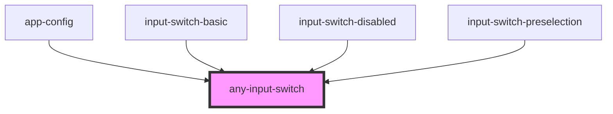

# any-input-switch

<!-- Auto Generated Below -->

## Overview

InputSwitch is used to select a boolean value.

## Properties

| Property        | Attribute         | Description                                                                                                     | Type      | Default                         |
| --------------- | ----------------- | --------------------------------------------------------------------------------------------------------------- | --------- | ------------------------------- |
| `anyStyle`      | `any-style`       | Inline style of the component.                                                                                  | `any`     | `null`                          |
| `anyTabIndex`   | `any-tab-index`   | Index of the element in tabbing order                                                                           | `number`  | `0`                             |
| `ariaLabeledBy` | `aria-labeled-by` | Establishes relationships between the component and label(s) where its value should be one or more element IDs. | `string`  | `null`                          |
| `checked`       | `checked`         | If `true`, the input-switch is selected.                                                                        | `boolean` | `false`                         |
| `disabled`      | `disabled`        | When present, it specifies that the element should be disabled.                                                 | `boolean` | `false`                         |
| `falseValue`    | `false-value`     | Value in unchecked state.                                                                                       | `any`     | `false`                         |
| `inputId`       | `input-id`        | Identifier of the focus input to match a label defined for the component.                                       | `string`  | ``any-isw-${inputSwitchIds++}`` |
| `name`          | `name`            | Name of the checkbox group.                                                                                     | `string`  | `this.inputId`                  |
| `readonly`      | `readonly`        | When present, it specifies that the component cannot be edited.                                                 | `boolean` | `false`                         |
| `styleClass`    | `style-class`     | Style class of the component.                                                                                   | `any`     | `null`                          |
| `trueValue`     | `true-value`      | Value in checked state.                                                                                         | `any`     | `true`                          |

## Events

| Event         | Description                                        | Type               |
| ------------- | -------------------------------------------------- | ------------------ |
| `aOnBlur`     | Emitted when the toggle loses focus.               | `CustomEvent<any>` |
| `aOnFocus`    | Emitted when the toggle has focus.                 | `CustomEvent<any>` |
| `valueChange` | Callback to invoke when value of dropdown changes. | `CustomEvent<any>` |

## CSS Custom Properties

| Name                              | Description                                                                                                              |
| --------------------------------- | ------------------------------------------------------------------------------------------------------------------------ |
| `--inputSwitchBorderRadius`       | The border radius of the input switch.                                                                                   |
| `--inputSwitchHandleBorderRadius` | The border radius of the input switch handle.                                                                            |
| `--inputSwitchHandleHeight`       | The height of the input switch handle.                                                                                   |
| `--inputSwitchHandleOffBg`        | The background color of the input switch handle when in the off state.                                                   |
| `--inputSwitchHandleOnBg`         | The background color of the input switch handle when in the on state.                                                    |
| `--inputSwitchHandleWidth`        | The width of the input switch handle.                                                                                    |
| `--inputSwitchHeight`             | The height of the input switch.                                                                                          |
| `--inputSwitchSliderOffBg`        | The background color of the input switch slider when in the off state.                                                   |
| `--inputSwitchSliderOffHoverBg`   | The background color of the input switch slider when in the off state and hovered.                                       |
| `--inputSwitchSliderOnBg`         | The background color of the input switch slider when in the on state, using the --primaryColor variable.                 |
| `--inputSwitchSliderOnHoverBg`    | The background color of the input switch slider when in the on state and hovered, using the --primaryDarkColor variable. |
| `--inputSwitchSliderPadding`      | The padding of the input switch slider.                                                                                  |
| `--inputSwitchWidth`              | The width of the input switch.                                                                                           |

## Dependencies

### Used by

 - [app-config](../app-showcase/config/app-config)
 - [input-switch-basic](../app-showcase/pages/input-switch/input-switch-basic)
 - [input-switch-disabled](../app-showcase/pages/input-switch/input-switch-disabled)
 - [input-switch-preselection](../app-showcase/pages/input-switch/input-switch-preselection)

### Graph

----------------------------------------------

*Built with love by **AdaleksTech!***
