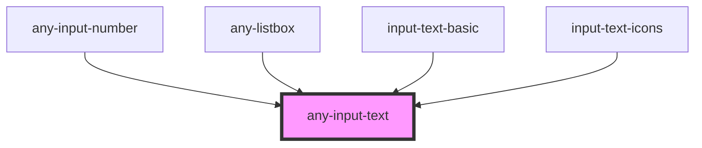

# any-input-text

<!-- Auto Generated Below -->

## Overview

The InputText component is a wrapper to the HTML input element with custom styling and additional
functionality.

## Properties

| Property            | Attribute             | Description                                                                                | Type      | Default                          |
| ------------------- | --------------------- | ------------------------------------------------------------------------------------------ | --------- | -------------------------------- |
| `aTitle`            | `a-title`             | Title text of the input text.                                                              | `string`  | `undefined`                      |
| `anyAriaRequired`   | `any-aria-required`   | Used to indicate that user input is required on an element before a form can be submitted. | `boolean` | `undefined`                      |
| `anyTabIndex`       | `any-tab-index`       | Specifies tab order of the element.                                                        | `string`  | `undefined`                      |
| `autocomplete`      | `autocomplete`        | Used to define a string that autocomplete attribute the current element.                   | `string`  | `undefined`                      |
| `disabled`          | `disabled`            | When present, it specifies that the element should be disabled                             | `boolean` | `false`                          |
| `floatLabel`        | `float-label`         | When enabled, the label will have floating effect on input text focus                      | `boolean` | `false`                          |
| `inputClass`        | `input-class`         | Inline style of the element                                                                | `string`  | `null`                           |
| `inputHolderClass`  | `input-holder-class`  | The class of input holder element                                                          | `string`  | `null`                           |
| `inputId`           | `input-id`            | Identifier of the focus input to match a label defined for the component.                  | `string`  | ``any-input-text-${inputIds++}`` |
| `inputStyle`        | `input-style`         | Inline style of the element                                                                | `any`     | `null`                           |
| `inputWrapperClass` | `input-wrapper-class` | The class of input wrapper element                                                         | `string`  | `null`                           |
| `label`             | `label`               | Label of the input text                                                                    | `string`  | `null`                           |
| `leftIconClass`     | `left-icon-class`     | The class of left icon wrapper element                                                     | `string`  | `null`                           |
| `maxlength`         | `maxlength`           | Maximum number of character allows in the input field.                                     | `number`  | `undefined`                      |
| `name`              | `name`                | Name of the input text.                                                                    | `string`  | `this.inputId`                   |
| `placeholder`       | `placeholder`         | Default text to display when no value in input text                                        | `string`  | `null`                           |
| `readonly`          | `readonly`            | When present, it specifies that the element value cannot be changed                        | `boolean` | `false`                          |
| `required`          | `required`            | When present, it specifies that an input field is required.                                | `boolean` | `undefined`                      |
| `rightIconClass`    | `right-icon-class`    | The class of right icon wrapper element                                                    | `string`  | `null`                           |
| `size`              | `size`                | Size of the input field.                                                                   | `number`  | `undefined`                      |
| `value`             | `value`               | Value of the input text                                                                    | `string`  | `null`                           |

## Events

| Event         | Description                                         | Type               |
| ------------- | --------------------------------------------------- | ------------------ |
| `valueChange` | Callback to invoke when value of input text changes | `CustomEvent<any>` |

## Methods

### `getInputRef() => Promise<HTMLInputElement>`

Retrieves a reference to the input element within the component.

#### Returns

Type: `Promise<HTMLInputElement>`

The input element, or null if not found.

## Slots

| Slot          | Description                                                   |
| ------------- | ------------------------------------------------------------- |
| `"end"`       | Slot for content to be placed at the end of the input.        |
| `"iconLeft"`  | Slot for an icon to be placed on the left side of the input.  |
| `"iconRight"` | Slot for an icon to be placed on the right side of the input. |
| `"start"`     | Slot for content to be placed at the start of the input.      |

## Shadow Parts

| Part              | Description                  |
| ----------------- | ---------------------------- |
| `"any-inputtext"` | The main input text element. |

## CSS Custom Properties

| Name                          | Description                                                                                                                |
| ----------------------------- | -------------------------------------------------------------------------------------------------------------------------- |
| `--inputBgColor`              | The background color of the input field.                                                                                   |
| `--inputBorder`               | The border of the input field.                                                                                             |
| `--inputErrorBorder`          | The border of the input field in case of an error.                                                                         |
| `--inputErrorBorderColor`     | The border color of the input field in case of an error, using the --errorColor variable.                                  |
| `--inputFilledBg`             | The background color of the input field when filled.                                                                       |
| `--inputFilledFocusBg`        | The background color of the input field when filled and focused.                                                           |
| `--inputFilledHoverBg`        | The background color of the input field when filled and hovered.                                                           |
| `--inputFocusBorderColor`     | The border color of the input field on focus, using the --primaryColor variable.                                           |
| `--inputHoverBorderColor`     | The border color of the input field on hover, using the --primaryColor variable.                                           |
| `--inputIconColor`            | The color of icons within the input field, using the --textColor variable.                                                 |
| `--inputPadding`              | The padding of the input field.                                                                                            |
| `--inputPlaceholderTextColor` | The text color of the input field placeholder.                                                                             |
| `--inputTextColor`            | The text color of the input field, using the --textColor variable.                                                         |
| `--inputTransition`           | The transition effect for the input field, involving border color and box shadow, using the --transitionDuration variable. |

## Dependencies

### Used by

 - [any-input-number](../input-number)
 - [any-listbox](../listbox)
 - [input-text-basic](../app-showcase/pages/input-text/input-text-basic)
 - [input-text-icons](../app-showcase/pages/input-text/input-text-icons)

### Graph

----------------------------------------------

*Built with love by **AdaleksTech!***
