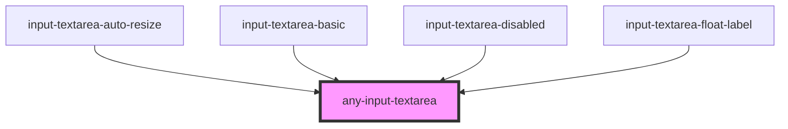

# any-input-textarea

<!-- Auto Generated Below -->

## Overview

The InputTextarea component is a wrapper to the HTML textarea element with custom styling and additional functionality.

## Properties

| Property            | Attribute             | Description                                                                                                                                                                                               | Type                        | Default                                 |
| ------------------- | --------------------- | --------------------------------------------------------------------------------------------------------------------------------------------------------------------------------------------------------- | --------------------------- | --------------------------------------- |
| `autoResize`        | `auto-resize`         | When present, textarea size changes as being typed.                                                                                                                                                       | `boolean`                   | `false`                                 |
| `autocapitalize`    | `autocapitalize`      | Indicates whether and how the text value should be automatically capitalized as it is entered/edited by the user. Available options: `"off"`, `"none"`, `"on"`, `"sentences"`, `"words"`, `"characters"`. | `string`                    | `"none"`                                |
| `cols`              | `cols`                | The visible width of the text control, in average character widths. If it is specified, it must be a positive integer.                                                                                    | `number`                    | `undefined`                             |
| `disabled`          | `disabled`            | When present, it specifies that the element should be disabled.                                                                                                                                           | `boolean`                   | `false`                                 |
| `floatLabel`        | `float-label`         | When enabled, the label will have floating effect on input text focus                                                                                                                                     | `boolean`                   | `false`                                 |
| `inputId`           | `input-id`            | Identifier of the focus input to match a label defined for the component.                                                                                                                                 | `string`                    | ``any-input-textarea-${textareaIds++}`` |
| `inputWrapperClass` | `input-wrapper-class` | The class of input wrapper element                                                                                                                                                                        | `string`                    | `null`                                  |
| `label`             | `label`               | Label of the input text                                                                                                                                                                                   | `string`                    | `null`                                  |
| `name`              | `name`                | Name of the input text.                                                                                                                                                                                   | `string`                    | `this.inputId`                          |
| `placeholder`       | `placeholder`         | Default text to display when no value in input textarea                                                                                                                                                   | `string`                    | `null`                                  |
| `readonly`          | `readonly`            | When present, it specifies that the element value cannot be changed                                                                                                                                       | `boolean`                   | `false`                                 |
| `rows`              | `rows`                | The number of visible text lines for the control.                                                                                                                                                         | `number`                    | `undefined`                             |
| `spellcheck`        | `spellcheck`          | If `true`, the element will have its spelling and grammar checked.                                                                                                                                        | `boolean`                   | `false`                                 |
| `value`             | `value`               | The value of the textarea.                                                                                                                                                                                | `string`                    | `""`                                    |
| `wrap`              | `wrap`                | Indicates how the control wraps text.                                                                                                                                                                     | `"hard" \| "off" \| "soft"` | `undefined`                             |

## Events

| Event         | Description                               | Type                                     |
| ------------- | ----------------------------------------- | ---------------------------------------- |
| `aOnBlur`     | Emitted when the input loses focus.       | `CustomEvent<FocusEvent>`                |
| `aOnFocus`    | Emitted when the input has focus.         | `CustomEvent<FocusEvent>`                |
| `aOnInput`    | Emitted when a keyboard input occurred.   | `CustomEvent<InputEvent>`                |
| `aOnResize`   | Emitted when the input has resized.       | `CustomEvent<any>`                       |
| `valueChange` | Emitted when the input value has changed. | `CustomEvent<TextareaChangeEventDetail>` |

## Methods

### `getInputElement() => Promise<HTMLTextAreaElement>`

Returns the native `<textarea>` element used under the hood.

#### Returns

Type: `Promise<HTMLTextAreaElement>`

### `setFocus() => Promise<void>`

Sets focus on the native `textarea` in `ion-textarea`. Use this method instead of the global
`textarea.focus()`.

#### Returns

Type: `Promise<void>`

## CSS Custom Properties

| Name                          | Description                                                                                                                |
| ----------------------------- | -------------------------------------------------------------------------------------------------------------------------- |
| `--inputBgColor`              | The background color of the input field.                                                                                   |
| `--inputBorder`               | The border of the input field.                                                                                             |
| `--inputErrorBorder`          | The border of the input field in case of an error.                                                                         |
| `--inputErrorBorderColor`     | The border color of the input field in case of an error, using the --errorColor variable.                                  |
| `--inputFilledBg`             | The background color of the input field when filled.                                                                       |
| `--inputFilledFocusBg`        | The background color of the input field when filled and focused.                                                           |
| `--inputFilledHoverBg`        | The background color of the input field when filled and hovered.                                                           |
| `--inputFocusBorderColor`     | The border color of the input field on focus, using the --primaryColor variable.                                           |
| `--inputHoverBorderColor`     | The border color of the input field on hover, using the --primaryColor variable.                                           |
| `--inputIconColor`            | The color of icons within the input field, using the --textColor variable.                                                 |
| `--inputPadding`              | The padding of the input field.                                                                                            |
| `--inputPlaceholderTextColor` | The text color of the input field placeholder.                                                                             |
| `--inputTextColor`            | The text color of the input field, using the --textColor variable.                                                         |
| `--inputTransition`           | The transition effect for the input field, involving border color and box shadow, using the --transitionDuration variable. |

## Dependencies

### Used by

 - [input-textarea-auto-resize](../app-showcase/pages/input-textarea/input-textarea-auto-resize)
 - [input-textarea-basic](../app-showcase/pages/input-textarea/input-textarea-basic)
 - [input-textarea-disabled](../app-showcase/pages/input-textarea/input-textarea-disabled)
 - [input-textarea-float-label](../app-showcase/pages/input-textarea/input-textarea-float-label)

### Graph

----------------------------------------------

*Built with love by **AdaleksTech!***
