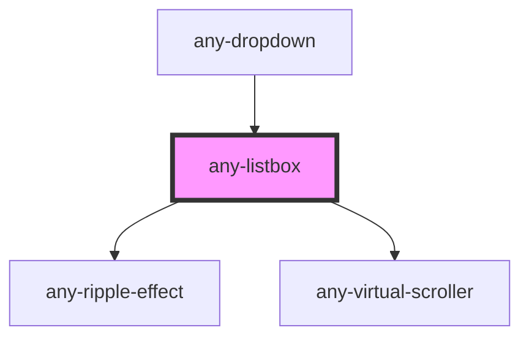

# any-listbox

<!-- Auto Generated Below -->

## Properties

| Property         | Attribute         | Description                                                               | Type      | Default                    |
| ---------------- | ----------------- | ------------------------------------------------------------------------- | --------- | -------------------------- |
| `anyStyle`       | `any-style`       | Inline style of the element                                               | `any`     | `null`                     |
| `disabled`       | `disabled`        | When present, it specifies that the element should be disabled            | `boolean` | `false`                    |
| `inputId`        | `input-id`        | Identifier of the focus input to match a label defined for the component. | `string`  | ``any-lb-${listboxIds++}`` |
| `listStyle`      | `list-style`      | Inline style of the list element                                          | `any`     | `null`                     |
| `name`           | `name`            | Name of the dropdown input.                                               | `string`  | `this.inputId`             |
| `optionLabel`    | `option-label`    | Name of the label field of an option                                      | `string`  | `"label"`                  |
| `optionValue`    | `option-value`    | Name of the value field of an option                                      | `string`  | `"value"`                  |
| `options`        | --                | An array of objects to display as the available options.                  | `any[]`   | `null`                     |
| `readonly`       | `readonly`        | When present, it specifies that the element value cannot be changed       | `boolean` | `false`                    |
| `scrollerHeight` | `scroller-height` | Max height of the content area in inline mode                             | `string`  | `"200px"`                  |
| `value`          | `value`           | Value of the listbox                                                      | `any`     | `null`                     |
| `virtualScroll`  | `virtual-scroll`  | When present, list virtual scroller is enabled                            | `boolean` | `false`                    |

## Events

| Event         | Description                                      | Type                                        |
| ------------- | ------------------------------------------------ | ------------------------------------------- |
| `valueChange` | Callback to invoke when value of listbox changes | `CustomEvent<SelectChangeEventDetail<any>>` |

## Shadow Parts

| Part      | Description |
| --------- | ----------- |
| `"items"` |             |

## Dependencies

### Used by

 - [any-dropdown](../dropdown)

### Depends on

- [any-ripple-effect](../ripple-effect)
- [any-virtual-scroller](../virtual-scroller)

### Graph

----------------------------------------------

*Built with love by **AdaleksTech!***
