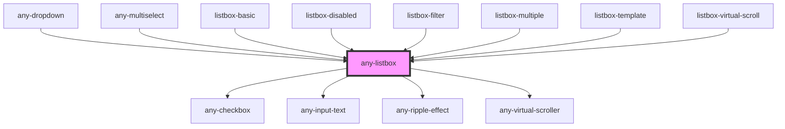

# any-listbox

<!-- Auto Generated Below -->

## Overview

ListBox is used to select one or more values from a list of items.

## Properties

| Property              | Attribute               | Description                                                                                                                                                                                                                                                       | Type      | Default                    |
| --------------------- | ----------------------- | ----------------------------------------------------------------------------------------------------------------------------------------------------------------------------------------------------------------------------------------------------------------- | --------- | -------------------------- |
| `anyStyle`            | `any-style`             | Inline style of the element.                                                                                                                                                                                                                                      | `any`     | `null`                     |
| `checkbox`            | `checkbox`              | When specified, allows selecting items with checkboxes.                                                                                                                                                                                                           | `boolean` | `false`                    |
| `dataKey`             | `data-key`              | A property to uniquely identify a value in options.                                                                                                                                                                                                               | `string`  | `null`                     |
| `disabled`            | `disabled`              | When present, it specifies that the element should be disabled.                                                                                                                                                                                                   | `boolean` | `false`                    |
| `emptyFilterMessage`  | `empty-filter-message`  | Text to display when filtering does not return any results. Defaults to global value in i18n translation configuration.                                                                                                                                           | `string`  | `undefined`                |
| `emptyMessage`        | `empty-message`         | Text to display when there is no data. Defaults to global value in i18n translation configuration.                                                                                                                                                                | `string`  | `undefined`                |
| `filter`              | `filter`                | When specified, displays a filter input at header.                                                                                                                                                                                                                | `boolean` | `false`                    |
| `filterBy`            | `filter-by`             | When filtering is enabled, filterBy decides which field or fields (comma separated) to search against.                                                                                                                                                            | `string`  | `null`                     |
| `filterLocale`        | `filter-locale`         | Locale to use in filtering. The default locale is the host environment's current locale.                                                                                                                                                                          | `string`  | `undefined`                |
| `filterMatchMode`     | `filter-match-mode`     | Defines how the items are filtered, valid values are "contains" (default) "startsWith", "endsWith", "equals", "notEquals", "in", "lt", "lte", "gt" and "gte".                                                                                                     | `string`  | `"contains"`               |
| `filterValue`         | `filter-value`          | When specified, filter displays with this value.                                                                                                                                                                                                                  | `string`  | `null`                     |
| `group`               | `group`                 | Whether to display options as grouped when nested options are provided.                                                                                                                                                                                           | `boolean` | `false`                    |
| `inputId`             | `input-id`              | Identifier of the focus input to match a label defined for the component.                                                                                                                                                                                         | `string`  | ``any-lb-${listboxIds++}`` |
| `listStyle`           | `list-style`            | Inline style of the list element.                                                                                                                                                                                                                                 | `any`     | `null`                     |
| `metaKeySelection`    | `meta-key-selection`    | Defines how multiple items can be selected, when true metaKey needs to be pressed to select or unselect an item and when set to false selection of each item can be toggled individually. On touch enabled devices, metaKeySelection is turned off automatically. | `boolean` | `true`                     |
| `multiple`            | `multiple`              | When specified, allows selecting multiple values.                                                                                                                                                                                                                 | `boolean` | `false`                    |
| `name`                | `name`                  | Name of the dropdown input.                                                                                                                                                                                                                                       | `string`  | `this.inputId`             |
| `optionDisabled`      | `option-disabled`       | Name of the disabled field of an option.                                                                                                                                                                                                                          | `string`  | `undefined`                |
| `optionGroupChildren` | `option-group-children` | Name of the options field of an option group.                                                                                                                                                                                                                     | `string`  | `"items"`                  |
| `optionLabel`         | `option-label`          | Name of the label field of an option.                                                                                                                                                                                                                             | `string`  | `"label"`                  |
| `optionValue`         | `option-value`          | Name of the value field of an option.                                                                                                                                                                                                                             | `string`  | `"value"`                  |
| `options`             | --                      | An array of objects to display as the available options.                                                                                                                                                                                                          | `any[]`   | `null`                     |
| `readonly`            | `readonly`              | When present, it specifies that the element value cannot be changed.                                                                                                                                                                                              | `boolean` | `false`                    |
| `scrollerHeight`      | `scroller-height`       | Max height of the content area in inline mode.                                                                                                                                                                                                                    | `string`  | `"200px"`                  |
| `searchIcon`          | `search-icon`           | Icon class of the filter search input icon.                                                                                                                                                                                                                       | `string`  | `"fa-solid:search"`        |
| `showToggleAll`       | `show-toggle-all`       | Whether header checkbox is shown in multiple mode.                                                                                                                                                                                                                | `boolean` | `true`                     |
| `value`               | `value`                 | Value of the listbox.                                                                                                                                                                                                                                             | `any`     | `null`                     |
| `virtualScroll`       | `virtual-scroll`        | When present, list virtual scroller is enabled.                                                                                                                                                                                                                   | `boolean` | `false`                    |

## Events

| Event         | Description                                      | Type                                        |
| ------------- | ------------------------------------------------ | ------------------------------------------- |
| `valueChange` | Callback to invoke when value of listbox changes | `CustomEvent<SelectChangeEventDetail<any>>` |

## Methods

### `setFilterInputFocus() => Promise<void>`

Sets the focus on the filter input element.

#### Returns

Type: `Promise<void>`

## Slots

| Slot     | Description                                                                                                     |
| -------- | --------------------------------------------------------------------------------------------------------------- |
| `"item"` | Represents individual items in the listbox. Use this slot to customize the appearance of each item in the list. |

## Shadow Parts

| Part      | Description                                       |
| --------- | ------------------------------------------------- |
| `"items"` | Represents the list of options.                   |
| `"lists"` | Represents the container for the list of options. |

## CSS Custom Properties

| Name                                   | Description                                                                  |
| -------------------------------------- | ---------------------------------------------------------------------------- |
| `--inputListBg`                        | The background color of the input list.                                      |
| `--inputListBorder`                    | The border of the input list.                                                |
| `--inputListHeaderBg`                  | The background color of the header in the input list.                        |
| `--inputListHeaderBorder`              | The border of the header in the input list.                                  |
| `--inputListHeaderCloseIconColor`      | The color of the close icon in the header of the input list.                 |
| `--inputListHeaderCloseIconHoverColor` | The hover color of the close icon in the header of the input list.           |
| `--inputListHeaderCloseIconTransition` | The transition properties of the close icon in the header of the input list. |
| `--inputListHeaderMargin`              | The margin of the header in the input list.                                  |
| `--inputListHeaderPadding`             | The padding of the header in the input list.                                 |
| `--inputListHeaderSearchIconColor`     | The color of the search icon in the header of the input list.                |
| `--inputListHeaderTextColor`           | The text color of the header in the input list.                              |
| `--inputListItemBgColor`               | The background color of each item in the input list.                         |
| `--inputListItemBorder`                | The border of each item in the input list.                                   |
| `--inputListItemDividerColor`          | The color of the divider in the input list.                                  |
| `--inputListItemFocusShadow`           | The shadow of each item in the input list on focus.                          |
| `--inputListItemHighlightBgColor`      | The background color of the highlighted item in the input list.              |
| `--inputListItemHighlightTextColor`    | The text color of the highlighted item in the input list.                    |
| `--inputListItemHoverBgColor`          | The background color of each item in the input list on hover.                |
| `--inputListItemHoverTextColor`        | The text color of each item in the input list on hover.                      |
| `--inputListItemMargin`                | The margin of each item in the input list.                                   |
| `--inputListItemPadding`               | The padding of each item in the input list.                                  |
| `--inputListItemTextColor`             | The text color of each item in the input list.                               |
| `--inputListItemTransition`            | The transition properties of each item in the input list.                    |
| `--inputListMinWidth`                  | The minimum width of the input list.                                         |
| `--inputListPadding`                   | The padding of the input list.                                               |

## Dependencies

### Used by

 - [any-dropdown](../dropdown)
 - [any-multiselect](../multiselect)
 - [listbox-basic](../app-showcase/pages/listbox/listbox-basic)
 - [listbox-disabled](../app-showcase/pages/listbox/listbox-disabled)
 - [listbox-filter](../app-showcase/pages/listbox/listbox-filter)
 - [listbox-multiple](../app-showcase/pages/listbox/listbox-multiple)
 - [listbox-template](../app-showcase/pages/listbox/listbox-template)
 - [listbox-virtual-scroll](../app-showcase/pages/listbox/listbox-virtual-scroll)

### Depends on

- [any-checkbox](../checkbox)
- [any-input-text](../input-text)
- [any-ripple-effect](../ripple-effect)
- [any-virtual-scroller](../virtual-scroller)

### Graph

----------------------------------------------

*Built with love by **AdaleksTech!***
