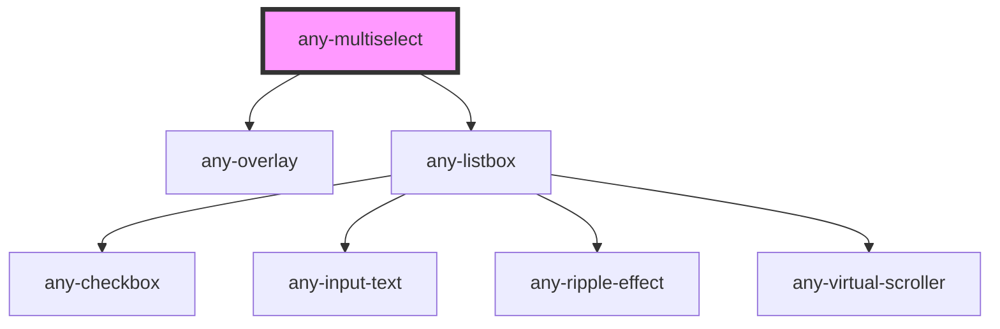

# any-multiselect

<!-- Auto Generated Below -->

## Properties

| Property              | Attribute               | Description                                                                                   | Type      | Default                                      |
| --------------------- | ----------------------- | --------------------------------------------------------------------------------------------- | --------- | -------------------------------------------- |
| `anyStyle`            | `any-style`             | Inline style of the element                                                                   | `any`     | `null`                                       |
| `anyTabIndex`         | `any-tab-index`         | Index of the element in tabbing order                                                         | `number`  | `0`                                          |
| `checkbox`            | `checkbox`              | When specified, allows selecting items with checkboxes                                        | `boolean` | `true`                                       |
| `clearIcon`           | `clear-icon`            | Icon class of the dropdown clear icon                                                         | `string`  | `"fa-solid:times"`                           |
| `dataKey`             | `data-key`              | A property to uniquely identify a value in options                                            | `string`  | `null`                                       |
| `defaultLabel`        | `default-label`         | When specified, allows selecting items with checkboxes                                        | `string`  | `this._translations[TranslationKeys.CHOOSE]` |
| `disabled`            | `disabled`              | When present, it specifies that the element should be disabled                                | `boolean` | `false`                                      |
| `dropdownIcon`        | `dropdown-icon`         | Icon class of the dropdown icon                                                               | `string`  | `"fa-solid:chevron-down"`                    |
| `filter`              | `filter`                | When specified, displays a filter input at header                                             | `boolean` | `true`                                       |
| `group`               | `group`                 | Whether to display options as grouped when nested options are provided                        | `boolean` | `false`                                      |
| `hideAnimation`       | `hide-animation`        | Transition options for the hide animation.                                                    | `string`  | `"growUp"`                                   |
| `inputId`             | `input-id`              | Identifier of the focus input to match a label defined for the component.                     | `string`  | ``any-ms-${multiselectIds++}``               |
| `name`                | `name`                  | Name of the dropdown input.                                                                   | `string`  | `this.inputId`                               |
| `optionGroupChildren` | `option-group-children` | Name of the options field of an option group.                                                 | `string`  | `"items"`                                    |
| `optionLabel`         | `option-label`          | Name of the label field of an option                                                          | `string`  | `"label"`                                    |
| `optionValue`         | `option-value`          | Name of the value field of an option                                                          | `string`  | `"value"`                                    |
| `options`             | --                      | An array of objects to display as the available options.                                      | `any[]`   | `null`                                       |
| `panelScrollHeight`   | `panel-scroll-height`   | Height of the viewport in pixels, a scrollbar is defined if height of list exceeds this value | `string`  | `"200px"`                                    |
| `placeholder`         | `placeholder`           | Default text to display when no option is selected                                            | `string`  | `null`                                       |
| `readonly`            | `readonly`              | When present, it specifies that the element value cannot be changed                           | `boolean` | `false`                                      |
| `showAnimation`       | `show-animation`        | Keyframe name for the show animation.                                                         | `string`  | `"growDown"`                                 |
| `showClear`           | `show-clear`            | When enabled, a clear icon is displayed to clear the value                                    | `boolean` | `false`                                      |
| `showToggleAll`       | `show-toggle-all`       | Whether header checkbox is shown in multiple mode                                             | `boolean` | `true`                                       |
| `value`               | `value`                 | Value of the dropdown list                                                                    | `any`     | `null`                                       |
| `virtualScroll`       | `virtual-scroll`        | When present, list virtual scroller is enabled                                                | `boolean` | `false`                                      |

## Events

| Event               | Description                                                  | Type               |
| ------------------- | ------------------------------------------------------------ | ------------------ |
| `aOnBlur`           | Callback to invoke when dropdown loses focus                 | `CustomEvent<any>` |
| `aOnClick`          | Callback to invoke when component is clicked                 | `CustomEvent<any>` |
| `aOnFocus`          | Callback to invoke when dropdown gets focus                  | `CustomEvent<any>` |
| `aOnPanelHide`      | Callback to invoke when dropdown overlay gets hidden         | `CustomEvent<any>` |
| `aOnPanelHideStart` | Callback to invoke when dropdown overlay before gets hidden  | `CustomEvent<any>` |
| `aOnPanelShow`      | Callback to invoke when dropdown overlay gets visible        | `CustomEvent<any>` |
| `aOnPanelShowStart` | Callback to invoke when dropdown overlay before gets visible | `CustomEvent<any>` |
| `valueChange`       | Callback to invoke when value of dropdown changes            | `CustomEvent<any>` |

## Dependencies

### Depends on

- [any-overlay](../overlay)
- [any-listbox](../listbox)

### Graph

----------------------------------------------

*Built with love by **AdaleksTech!***
