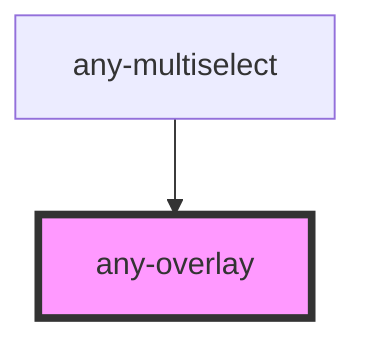

# any-overlay

<!-- Auto Generated Below -->

## Properties

| Property        | Attribute        | Description                                          | Type      | Default      |
| --------------- | ---------------- | ---------------------------------------------------- | --------- | ------------ |
| `autoZIndex`    | `auto-z-index`   | Whether to automatically manage layering             | `boolean` | `true`       |
| `baseZIndex`    | `base-z-index`   | Base zIndex value to use in layering                 | `string`  | `"0"`        |
| `hideAnimation` | `hide-animation` | Transition options for the hide animation.           | `string`  | `"growUp"`   |
| `showAnimation` | `show-animation` | Keyframe name for the show animation.                | `string`  | `"growDown"` |
| `target`        | `target`         | The target element to attach the dropdown to.        | `any`     | `undefined`  |
| `visible`       | `visible`        | Whether the dropdown is currently visible or hidden. | `boolean` | `false`      |

## Events

| Event          | Description                                                              | Type               |
| -------------- | ------------------------------------------------------------------------ | ------------------ |
| `aOnHide`      | Callback to invoke when the dropdown overlay becomes hidden.             | `CustomEvent<any>` |
| `aOnHideStart` | Callback to invoke when the dropdown overlay is about to become hidden.  | `CustomEvent<any>` |
| `aOnShow`      | Callback to invoke when the dropdown overlay becomes visible.            | `CustomEvent<any>` |
| `aOnShowStart` | Callback to invoke when the dropdown overlay is about to become visible. | `CustomEvent<any>` |

## Dependencies

### Used by

 - [any-multiselect](../multiselect)

### Graph

----------------------------------------------

*Built with love by **AdaleksTech!***
