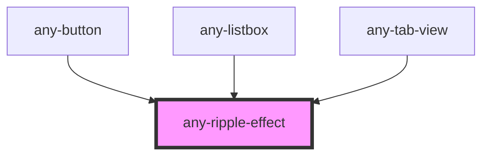

# any-ripple-effect

<!-- Auto Generated Below -->

## Properties

| Property | Attribute | Description                     | Type                       | Default     |
| -------- | --------- | ------------------------------- | -------------------------- | ----------- |
| `type`   | `type`    | Sets the type of ripple-effect: | `"bounded" \| "unbounded"` | `"bounded"` |

## Shadow Parts

| Part        | Description |
| ----------- | ----------- |
| `"any-ink"` |             |

## Dependencies

### Used by

 - [any-button](../button)
 - [any-listbox](../listbox)
 - [any-tab-view](../tab-view)

### Graph

----------------------------------------------

*Built with love by **AdaleksTech!***
