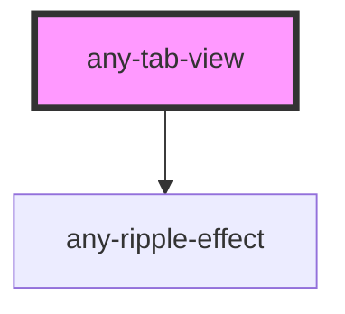

# any-tab-view

<!-- Auto Generated Below -->

## Properties

| Property      | Attribute      | Description                                                      | Type     | Default |
| ------------- | -------------- | ---------------------------------------------------------------- | -------- | ------- |
| `activeIndex` | `active-index` | Index of the active tab to change selected tab programmatically. | `number` | `0`     |
| `anyStyle`    | `any-style`    | Inline style of the component.                                   | `any`    | `null`  |
| `styleClass`  | `style-class`  | Style class of the component.                                    | `string` | `null`  |

## Dependencies

### Depends on

- [any-ripple-effect](../ripple-effect)

### Graph

----------------------------------------------

*Built with love by **AdaleksTech!***
