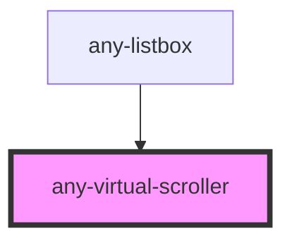

# any-virtual-scroller

<!-- Auto Generated Below -->

## Properties

| Property           | Attribute            | Description                                                                                                                                                                                                                                                                                                          | Type      | Default     |
| ------------------ | -------------------- | -------------------------------------------------------------------------------------------------------------------------------------------------------------------------------------------------------------------------------------------------------------------------------------------------------------------- | --------- | ----------- |
| `anyStyle`         | `any-style`          | Inline style of the component                                                                                                                                                                                                                                                                                        | `any`     | `null`      |
| `contentElemClass` | `content-elem-class` | Class name of the content element where items will be rendered                                                                                                                                                                                                                                                       | `string`  | `null`      |
| `contentElemTag`   | `content-elem-tag`   | Tag name of content element whwre items will be rendered                                                                                                                                                                                                                                                             | `string`  | `"div"`     |
| `delay`            | `delay`              | Threshold in milliseconds to delay lazy loading during scrolling                                                                                                                                                                                                                                                     | `number`  | `250`       |
| `itemElemClass`    | `item-elem-class`    | Class name of the item element                                                                                                                                                                                                                                                                                       | `string`  | `null`      |
| `itemSize`         | `item-size`          | Height of an item in the list                                                                                                                                                                                                                                                                                        | `number`  | `null`      |
| `itemTag`          | `item-tag`           | Tag name for supporting elements: spacing extra rows, empty-data row. It will be determined by itself once data provided, so it's optional. But if your data is not provided during initialization - it is better to specify this option because otherwise plugin will be unable to correctly render empty-data row. | `string`  | `"div"`     |
| `items`            | --                   | An array of objects to display                                                                                                                                                                                                                                                                                       | `any[]`   | `[]`        |
| `lazy`             | `lazy`               | Defines if data is loaded and interacted with in lazy manner                                                                                                                                                                                                                                                         | `boolean` | `false`     |
| `noDataText`       | `no-data-text`       | Text for placeholder element if there is no data provided                                                                                                                                                                                                                                                            | `string`  | `"No Data"` |
| `rowsPerPage`      | `rows-per-page`      | Number of rows to display per page                                                                                                                                                                                                                                                                                   | `number`  | `null`      |
| `scrollElemClass`  | `scroll-elem-class`  | Class name of the scroll element                                                                                                                                                                                                                                                                                     | `string`  | `null`      |
| `scrollerHeight`   | `scroller-height`    | Max height of the content area in inline mode                                                                                                                                                                                                                                                                        | `any`     | `null`      |
| `styleClass`       | `style-class`        | Inline style of the component                                                                                                                                                                                                                                                                                        | `string`  | `null`      |

## Events

| Event               | Description                                                         | Type               |
| ------------------- | ------------------------------------------------------------------- | ------------------ |
| `aOnItemClick`      | Callback when item is clicked                                       | `CustomEvent<any>` |
| `aOnLazyLoad`       | Callback to invoke in lazy mode to load new data                    | `CustomEvent<any>` |
| `clusterChanged`    | Will be called right after replacing previous cluster with new one  | `CustomEvent<any>` |
| `clusterWillChange` | Will be called right before replacing previous cluster with new one | `CustomEvent<any>` |
| `scrollingProgress` | Will be called on scrolling. Returns progress position              | `CustomEvent<any>` |

## Dependencies

### Used by

 - [any-listbox](../listbox)

### Graph

----------------------------------------------

*Built with love by **AdaleksTech!***
